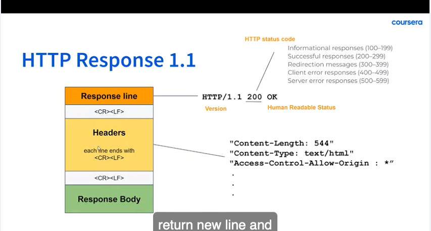
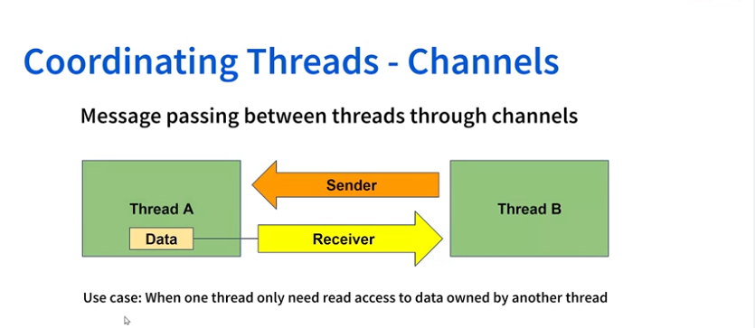
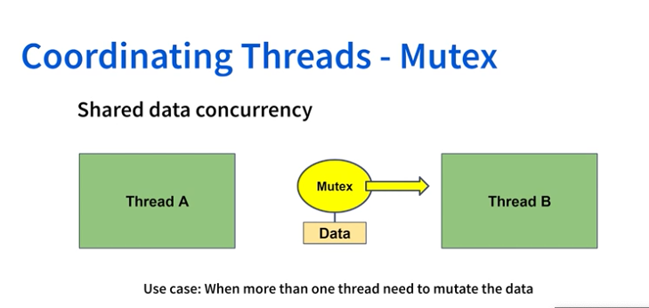
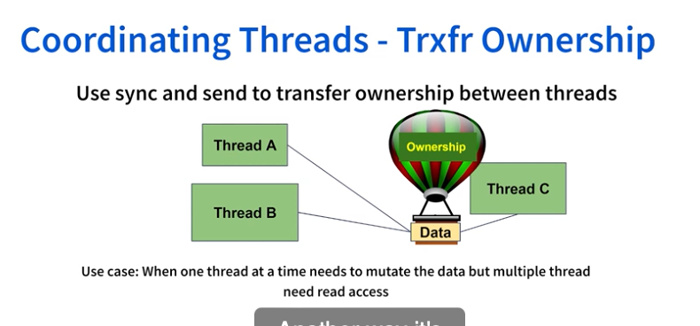
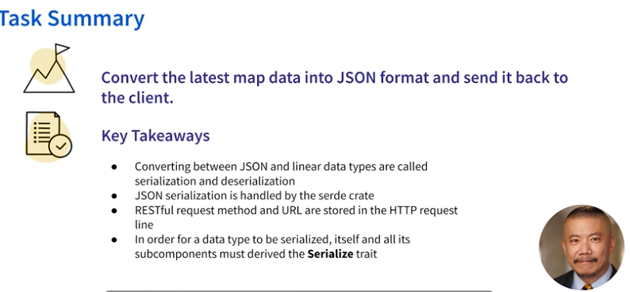
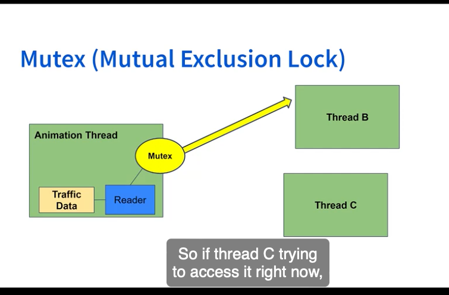
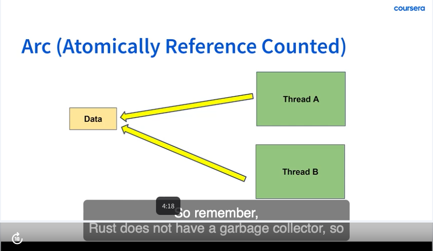
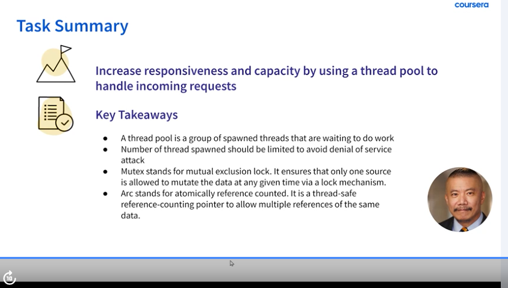
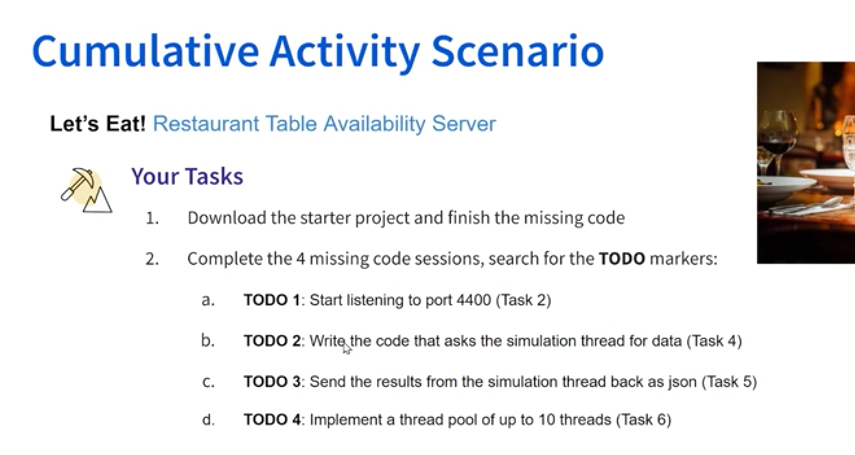

# Rust game

Created: December 28, 2024 5:15 AM

Project link - https://www.coursera.org/learn/restful-api-rust-game-map-server/home/week/1

Learning:

- [x]  HTTP request
    - [x]  I am able ot call to tcp port and get data via buffer into an array
- [x]  Error handling
- [x]  multi-threading
- [x]  mapserver

---

1. Create a TCP Listener for localhost:5000
2. for result in listener() - loop through each refresh or each curl request given to listener
3. Read the HTTP request - store it in an array and print it out
4. Then Send an HTTP request - compose headers, and body and payload, this will be sent to the client
5. 
    
    
    
6. Practice optional exercise learnings:
    1. We need a port, otherwise we get error - invalid socket address
    2. We need content_type, complete headers, payload must include the “\r\n” which will also calculate the length of payload.
    3. We actually need two sets or “\r\n” between headers and payload, let’s try this, yeah, it worked, so ultimately we only need content_length! Nice.
7. Inter-thread communication
    1. There are different ways to achieve this - first one is via channels, passing message between threads via channels
    2. One thread can ask for data from another thread and it’s sufficient for the sender thread to be in a read-only state. Sender-receiver method.
        
        
        
    3. Mutex = lock: The data is locked to make sure only 1 thread has access to the data at a time.
        
        
        
    
    d. Another way is to transfer the ownership of the data, whoever has the ownership can mutate the data.
    
    
    
    - We need two channels for 2 different types of data transfers

Task 5: Sending json data

1. Before we send json data, we need to convert it into a series of bytes - this is called serialisation.
2. We use the `serde` - serialization, and deserialisation library - convert to string
3. Content-Type is now application/json
4. Add some error checks for headers - first element, the header must be at least 6 characters long, if it does not start with GET, return None
5. Live server extension
    
    
    

Task 6: Multithreading

1. We are going to use multithreading to increase app’s responsiveness and capacity
2. Mutex = Mutual Exclusion lock. Only 1 thread can access the data at any given time
3.  

1. Arc = Atomically reference counted. Rust does not get rid of the data unless all it's references are being accounted for. 
    
    
    
2. Multithread = share resources between threads
3. We don’t want users to wait for their request to be processed and returned after a very long time, we don’t to respond faster, so we use `thread pool`.  A pool of threads that is ready to do work.
4. Denial of Service - when a user makes a bunch of service requests, we don’t want to overwhelm the server, so we block the requests for sometime.
5. We limit the number of requests and threads that can be processed to 5
6. 

- Optional practice task 2: Monitor Rocket fuel tank depletion
    - Create 2 channels - 1st for request transmissions and 2nd for data transmission
    - Monitor for request using the request transmission’s receiver thread, if there is a request, send the data on data sender thread, the data is the rocket’s fuel content
    - Send data on loop using request transmission’s sender thread and wait for a reply, once we get a reply, print the data using data transmissions receiver thread
    - Set a receiving timeout to be 5000 milliseconds
- Optional task - cumulative learning: letseat. Simulating people coming in and out of a restaurant
    - main thread and animation thread
    - 
        
        